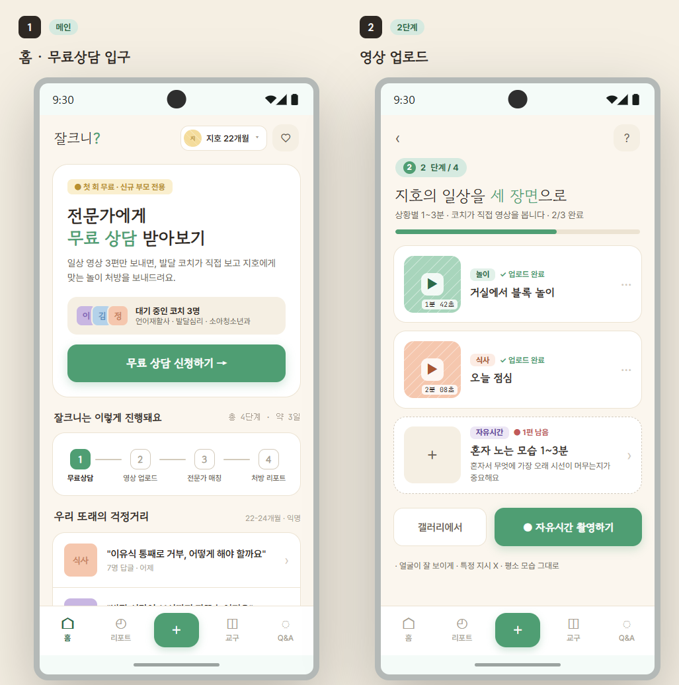
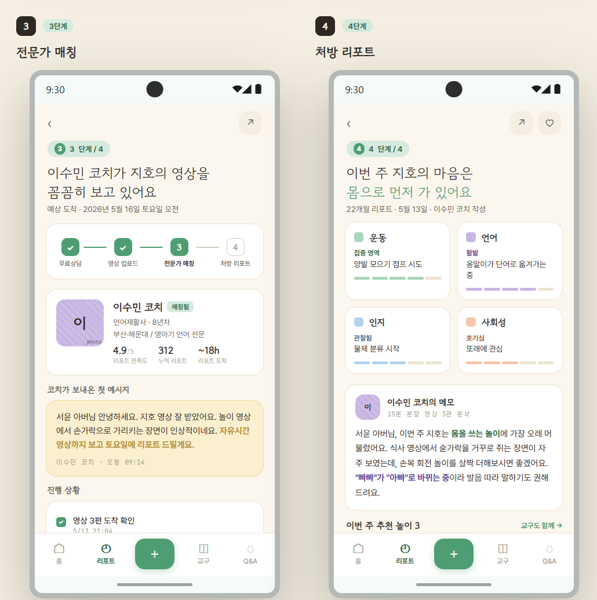
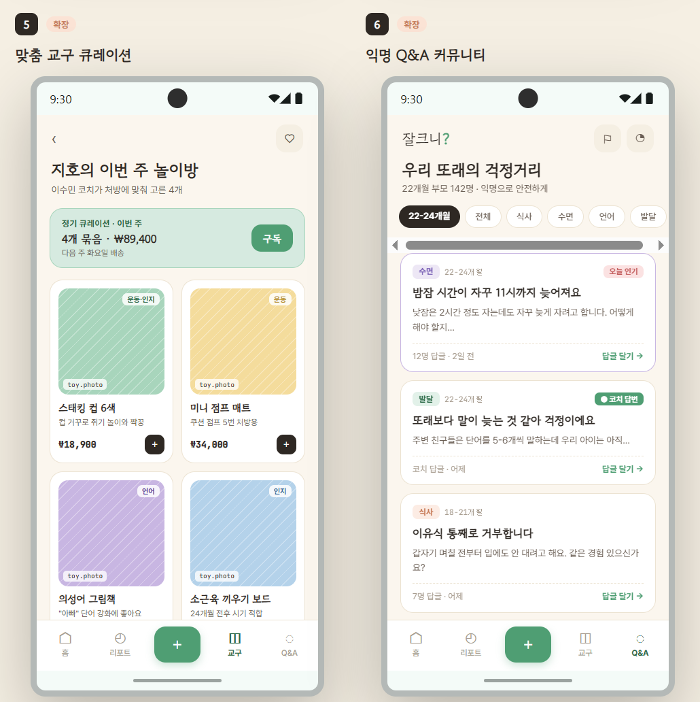

# 👶 잘크니? (Jal-Keuni?)
> **"우리 아이, 시기에 맞게 잘 크고 있는 걸까?" 더 이상 혼자 걱정하지 마세요.**
> **일상 영상 3분으로 시작하는 비대면 아동 발달 분석 및 맞춤형 놀이·교구 큐레이션 플랫폼**

---

## 📌 목차
1. [프로젝트 소개 (Introduction)](#-프로젝트-소개-introduction)
2. [기획 배경 (Background)](#-기획-배경-background)
3. [해결하고자 하는 문제 & 타겟 (Problem & Target)](#-해결하고자-하는-문제--타겟-problem--target)
4. [기존 서비스의 한계 & 차별점 (Limitations & Differentiation)](#-기존-서비스의-한계--차별점-limitations--differentiation)
5. [핵심 기능 (Core Features)](#-핵심-기능-core-features)
6. [사업 아이디어 도식화 (Business Flow Diagram)](#-사업-아이디어-도식화-business-flow-diagram)
7. [서비스 UI 화면 (Service UI Screens)](#-서비스-ui-화면-service-ui-screens)
8. [실현 계획 및 로드맵 (Execution Plan & Roadmap)](#-실현-계획-및-로드맵-execution-plan--roadmap)

---

## 🌟 프로젝트 소개 (Introduction)

**잘크니?**는 초보 부모들의 막연한 발달 불안감을 해소하기 위해 탄생한 **영상 기반 비대면 아동 발달 분석 및 맞춤형 놀이 처방 플랫폼**입니다.

번거로운 오프라인 센터 예약과 방문, 혹은 주관적인 수기 설문조사 대신, 부모가 스마트폰으로 촬영한 **아이의 자연스러운 일상 영상 3분**만 업로드하면 전문 아동 발달 코치 군단이 객관적으로 발달 상태를 분석하고, 아이에게 꼭 필요한 놀이 교구 및 홈스쿨링 솔루션을 원스톱으로 제공합니다.

* **한 줄 소개**: 아이의 성장, 더 이상 혼자 걱정하지 마세요 (영상 기반 양육 큐레이션 앱)
* **핵심 슬로건**: *"가장 자연스러운 모습이 가장 정확한 진단입니다."*

---

## 🔍 기획 배경 (Background)

* **초보 부모의 현실적인 고충**: 1세, 3세 두 아이를 키우는 아빠로서 육아 과정에서 느낀 가장 큰 심리적 불안감은 체력적인 한계보다 **"지금 우리 아이한테 어떤 놀이를 해줘야 올바르게 자랄까?", "우리아이가 시기에 맞게 잘 크고 있는 걸까?"**라는 물음에 명쾌한 해답을 찾을 수 없다는 점이었습니다.
* **비교와 지레짐작의 한계**: 어린이집 등하원길에 또래 아이들의 발달을 곁눈질로 확인하거나, 하원 시간에 선생님께 짧게 여쭤보지만, 아이들마다 흥미와 발달 속도는 모두 제각각이므로 주변 정보만을 우리 아이에게 대입하기엔 무리가 있었습니다.
* **오프라인 진단의 장벽**: 정식 발달센터나 병원을 방문하기엔 시간적 여유가 없고 대기도 지나치게 깁니다. 무엇보다 "내 아이를 데리고 진단/검사를 받으러 간다"는 행위 자체가 부모에게는 감당하기 힘든 심리적 부담(회색지대 방치)으로 작용합니다.
* **일상 데이터의 재발견**: 부모들의 핸드폰 속에 매일 가득 쌓이고 있는 아이들의 일상 영상(노는 모습, 옹알이, 걸음마 등)에 **행동 발달 데이터**가 담겨 있음에 착안하여, 이 영상을 전문가와 연결해 쉽고 편안하게 진단받을 수 있는 환경을 만들고자 본 프로젝트를 시작하게 되었습니다.

---

## 💡 해결하고자 하는 문제 & 타겟 (Problem & Target)

### 🎯 핵심 타겟 (Core Target)
1. **0~36개월 영아기 자녀를 둔 초보 부모**: 발달 변동성이 가장 크고 개별 행동의 격차가 넓어 세밀하고 즉각적인 놀이 피드백이 가장 절실한 시기입니다.
2. **맞벌이 부부**: 평일 낮 시간대에 운영되는 오프라인 보건소나 육아종합지원센터를 방문하기 어려운 직장인 양육자입니다.
3. **구체적인 놀이 처방을 원하는 부모**: 발달 지연을 의심할 단계는 아니지만, 현재 내 아이의 흥미와 행동에 딱 맞는 교구와 놀이법을 추천받고 싶은 양육자입니다.

---

## 🔄 기존 서비스의 한계 & 차별점 (Limitations & Differentiation)

| 구분 | 기존 서비스 (오프라인 센터 / 기존 앱 '별빛' 등) | **잘크니? (Jal-Keuni?)** |
| :---: | :--- | :--- |
| **접근성** | 평일 낮 시간 위주 오프라인 대면 방문, 기나긴 예약 대기 | **시공간 제약 없는 비대면 스마트폰 영상 분석** |
| **데이터 입력** | 부모의 주관적 기억에 의존하는 수십 문항의 수기 설문 | **일상의 자연스러운 짧은 동영상 업로드 (객관적 관찰)** |
| **진단 주체** | 기계적이고 획일적인 AI 챗봇 형태의 가이드 | **검증된 아동 발달/놀이/소아과 전문가 직접 분석** |
| **솔루션 제공** | 이론적인 결과 안내에 그쳐 실천 방안이 모호함 | **분석 리포트 + 즉시 실행 가능한 맞춤 교구 정기 구독/추천** |
| **공공 연계** | 공공 지원 혜택 및 기관 연계 정보의 파편화 | **아이 상태에 맞춰 지자체 바우처 및 공공 사업 연계 (허브)** |

---

## ✨ 핵심 기능 (Core Features)

1. **초간단 일상 영상 업로드 및 설문**
   * 놀이, 식사, 자유시간 등 일상의 자연스러운 모습을 담은 짧은 영상 3편(각 1~3분)과 보조 설문지만 작성하여 제출하면 간편하게 분석 신청이 완료됩니다.
2. **전문가 매칭 및 맞춤형 발달 리포트 제공**
   * 소아청소년과 전문의, 발달심리 전문가, 언어재활사 등 엄선된 발달 코치 Pool을 구축하여, 아이의 언어·인지·운동·사회성 등 핵심 영역별 관찰 분석 리포트를 발행합니다.
3. **맞춤형 놀이 교구 및 홈스쿨링 큐레이션**
   * 진단 결과를 바탕으로 가정 내에서 쉽게 수행할 수 있는 놀이 코칭 가이드를 제공합니다.
   * 무분별한 장난감 구매 대신, 아이의 현재 흥미와 발달에 딱 맞춰 낭비가 없는 맞춤 교구 구매/대여 큐레이션 커머스를 연결합니다.
4. **정서적 지지를 위한 익명 Q&A 라이브러리**
   * 다른 부모들의 실제 발달 고민과 전문가 답변을 익명으로 공유하는 라이브러리를 통해 부모 간의 정서적 공감대 형성과 심리적 지지를 돕습니다.
5. **공공 인프라 연계 허브**
   * 발달 검사나 심화 진단이 필요해 보이는 아동에게는 '영유아 발달지원 바우처', '육아종합지원센터' 등 정부와 지자체의 공공 복지 사업을 매끄럽게 연결해 줍니다.

---

## 📊 사업 아이디어 도식화 (Business Flow Diagram)

서비스의 전반적인 기획 플로우(Problem ➡️ Input ➡️ Solution ➡️ Loop), 핵심 가치 제안 및 수요자–플랫폼–공급자가 하나로 연결되는 비즈니스 생태계 도식화 내용입니다.

---

## 📱 서비스 UI 화면 (Service UI Screens)

현재 설계된 **잘크니?** 서비스의 핵심 모바일 화면 레이아웃입니다.

| 1. 일상 영상 업로드 및 자가진단 | 2. 전문가 발달 분석 리포트 수령 | 3. 맞춤형 놀이/교구 큐레이션 추천 |
| :---: | :---: | :---: |
|  |  |  |

---

## 🚀 실현 계획 및 로드맵 (Execution Plan & Roadmap)

### 💰 창업 활동 자금 (200만 원) 집행 계획
* **MVP 기획 및 화면 설계 (약 40만 원)**: '영상 업로드 ➡️ 전문가 매칭 ➡️ 리포트 수령 ➡️ 교구 큐레이션 및 공공 사업 연계'를 잇는 핵심 사용자 경험(UX) 상세 설계.
* **베타 앱 직접 개발 (약 100만 원)**: 개발 경험을 100% 활용하여 외주 없이 자체적으로 핵심 기능 중심의 MVP(최소 기능 제품)를 신속하게 구현하며, 초기 고객 피드백과 버그 수정을 즉각적으로 반영할 수 있는 애자일 개발 환경 구축.
* **전문가 사전 섭외 및 리포트 표준화 (약 60만 원)**: 소아청소년 전문 코치, 아동 발달 전문가 등 2~3명을 초기 파트너로 초빙하여 전문성 신뢰도를 구축하고, 영역별 리포트 표준 양식을 정립.

### 📅 단계별 마일스톤 (Milestones)
* **1라운드 (시제품 제작)**:
  * 베타 앱 공식 출시
  * 가까운 부산권 지역 부모 10~20명 대상 무료 시범 운영 진행
  * 전문가 리포트 만족도 및 재이용 의향 핵심 데이터 확보
* **2라운드 (시제품 고도화)**:
  * 비즈니스 모델(BM)인 '교구 정기 구독' 고도화 및 유료 결제 모델 검증
  * 전문가 참여 Pool 10명 이상으로 확대
  * 주요 아동 교구 전문 브랜드 2~3개사와 큐레이션 파트너십 제휴 체결
* **3라운드 (본격 사업화)**:
  * 부산을 거점으로 타 광역 지자체까지 서비스 영역 확장
  * 부산시 각 구별 '육아종합지원센터' 등 공공 기관과의 협업 및 위탁 운영 MOU 추진

